# Answers

## Software as a Service - Back-End Development

### Diploma of Information Technology (Advanced Programming)  

### Diploma of Information Technology (Back-End Development)

Replace GIVEN_NAME_HERE, FAMILY_NAME_HERE and STUDENT_ID_HERE entries with your details:

| Given Name      | Family Name      | Student ID      |
|-----------------|------------------|-----------------|
| Khushboo        | Dayal            | 20128654         |     |
| GIVEN_NAME_HERE | FAMILY_NAME_HERE | STUDENT_ID_HERE |


# Declaration

I, THE ABOVE NAMED student, by submitting this assessment, I am acknowledging the following:

- The submission is completely my own work.
- I have not used AI in the formuation of the answers within this assessment.
- I have acknowledged all sources of information used in this work (if required).
- I have kept a copy of this assessment (where practicable).
- I understand a copy of my assessment will be kept by TAFE for their records.
- I understand my assessment may be selected for use in the TAFEs validation and audit process to ensure student assessment meets requirements.

When submitting this assessment, I am accepting the above acknowledgement.


---

```table-of-contents
title: # Contents
style: nestedList
minLevel: 0
maxLevel: 3
includeLinks: true
```

---

# How to Answer Questions

Each time you answer a question, fill out the space provided for the answer to the question.

## Answer Requiring an Explanation

Answers to questions should be completed as "block quotes", replacing the `ANSWER_HERE` with the answer, and preceding each line with a greater than sign `>`. To add a new paragraph ensure you leave a `>` with no text after it.

Example:

```markdown
    ## Question Z - How many sofwarte developers does it take to change a lightbulb?
    
    > None. 
	> It is a hardware problem.
```

## Answer Requiring Code

When answering a question that requires code to be included, use a "code block", which starts with three back-ticks (/`) plus the language for the code (e.g. php, js, cpp, python, shell, text, et al).

Example:

```markdown
	## Question X - Title

	Query Solution:

	```js
	db.collection_name.find();
	```
```

> Note: 
>
> The NoSQL code used to answer the question is contained in a code block,wich opens with three back-ticks (\`\`\`) followed by js, contains the code on the lines below, and ends with three back-ticks (\`\`\`) at the start of the next line after the code. An example is shown above.
> 
> It is important that code blocks start at the beginning of the line for formatting on GitHub, Obsidian or your preferred IDE render the code correctly.

## Answer Requiring Image(s) to Be Inserted

Images are to be saved in a folder called "`assets`" and are embedded into the Markdown document.

Images for this assessment MUST be named in the form `step-X-Ya.ext` where:

- `X` is the step number (e.g. for step 5 the number is `5`)
- `Y` is the question dot number (e.g. for question `2.3` the dot number is `3` )
- `a` is an optional letter to allow for multiple images for an answer.
- `ext` is the filename extension (e.g. `png`, `jpg`, `jpeg`, `svg`, et al)

To insert an image use the following syntax:

```markdown

```

For example, the markdown code:

```markdown

```

Gives:


---


# Step 1: Setting Up for Assessment

This step provides a checklist for yout to ensure you have set up the assessment requirements as needed.


## Checklist

Put an X between each of the pairs of `[ ]` when you have completed the task:

> - [ ] Create a new **empty** & **private** repository on GitHub (or the equivalent).
> - [ ] Repository is named `kd-ICT50220-SaaS-2-BED-NoSQL` replacing `xxx` with your initials.
> - [ ] Cloned the repository to your local PC.
> - [ ] Created a new folder called `assets` inside your cloned repository.
> - [ ] Created an empty `ReadMe.md`.
> - [ ] Created an empty `.gitignore` file in the assets folder.
> - [ ] Downloaded the provided `sample.gitignore` file, moved it into the repository folder, and renamed it to `.gitignore`.
> - [ ] Placed a copy of the assessment's Word document into the repository folder.
> - [ ] Added all the new files and folders to the repository, commited them to version control, and pushed them to your private remote repository.

---

# Step 2: NoSQL Systems

This step verifies you understand concepts that includes, but is not limited to such as databases, collections, fields, documents and naming conventions.

## 2.1 Naming Databases, Collections and Fields

What naming convention will you use for the database, collections and fields used in the assessment scenario?

>   For this assessment, the following naming conventions will be used:
> - **Database and Collections**: `snake_case` (e.g., `my_database`, `movie_collection`). This convention is easy to read and avoids any potential issues with case sensitivity across different operating systems.
> - **Fields**: `camelCase` (e.g., `runningTime`, `boxOfficeTakings`).


Why did you choose this naming convention?

> I chose these conventions because they are widely adopted standards in the MongoDB and broader software development community.

> `camelCase` for fields aligns with the naming conventions of many programming languages, including JavaScript, which is used for MongoDB queries. This consistency makes the code more intuitive for developers.

> `snake_case` for database and collection names enhances readability and prevents issues related to case sensitivity that can arise in different file systems and operating environments.


## 2.2 Identify Data Types

Using the sample data provided, identify the field types and suitable names for the data storage in a MongoDB database.

In the `notes` column, add any clarifying details that may be useful.

Replace `FIELD_NAME_HERE` and `DATA_TYPE_HERE` in the table below.

> | Item                | Field Name      | Data Type       | Notes                                |
> |---------------------|-----------------|-----------------|--------------------------------------|
> | ID                  | _id             | ObjectId        | MongoDB's default unique identifier. |
> | Title               | title           |     string          |                                      |
> | Year                | year            | Number          | four digit year                      |
> | Writer              | writer          | String          |                                      |
> | Summary             | synopsis        | String          |                                      |
> | Franchise           | franchise       | String          |                                      |
> | Running Time        | runningTime     | Number          | **min**utes                          |
> | Budget              | budget          | Number          | **$m**illions                        |
> | Box Office Takings  | boxOffice       | Number          | **$m**illions, **$b**illions         |


## 2.3 Defining Terms

Briefly explain what is meant by the terms database, collection, document and field in terms of MongoDB.

>  In MongoDB, the data is organized in a hierarchical manner:

> - **Database**: A database is a top-level container for collections. A single MongoDB instance can host multiple databases, each acting as a separate namespace for its data.
> - **Collection**: A collection is a grouping of MongoDB documents, analogous to a table in a relational database. Collections do not enforce a rigid schema, meaning documents within the same collection can have different fields.
> - **Document**: A document is a single record within a collection, stored in BSON (Binary JSON) format. It consists of field-and-value pairs and is similar to a row in a relational table or a JSON object.
> - **Field**: A field is a key-value pair within a document

 

## 2.4 NoSQL Database Types

Briefly outline the key features and advantages for TWO of the following NoSQL database types:

- Document Database
- Key-Value Store
- Wide-Column Oriented Database
- Graph Database

> ### Database Type 1: Document Database
>
>  Stores data as JSON-like documents; flexible schema. Useful for unstructured data like movies or blogs.


> ### Database Type 2: Key-Value Store
>
>Stores data as key-value pairs; highly performant for caching or session storage.


## 2.5 NoSQL Database Systems

Provide one example product (commercial or open source) for each of your NoSQL NoSQL Database types.

You may **NOT** include _MongoDB_ which is an example of a _Document Database_.

> ### Database Type 1: Document Database
>
> CouchDB, Firebase Firestore


> ### Database Type 2:Key-Value Store
>
> Redis, Amazon DynamoDB


## 2.6 NoSQL Database Uses

Provide an example for each of your NoSQL database of the situation when your database types may provide a benefit when used.

The situations/application of the database types must be different.

> ### Database Type 1:Document Database
>
> Useful for storing movie collections, product catalogs, or user profiles.


> ### Database Type 2: Key-Value Store
>
> Ideal for caching frequent queries, session management, or leaderboard storage.


# Step 3: NoSQL Databases & Collections

## 3.1 Connecting

- Connect to a running instance of MongoDB (preferred to be your MongoDB Atlas instance).

Add the Connection String used to connect to your MongoDB Atlas instance:

> ```js
> 	mongodb+srv://<username>:<password>@<cluster-url>/?retryWrites=true&w=majority
> ```


### 3.2 Database Creation

- Create and use a database named `saas_bed_portfolio_2025s2`.

> ```js
> 	use saas_bed_portfolio_2025s2
> ```

Did you encounter any issues when creating the database? If you did, how did you resolve them?

> No issues were encountered. In MongoDB, the `use` command switches to a specified database but does not create it on disk immediately. The database is only physically created when the first document is inserted into a collection within it. This "lazy creation" approach is seamless and does not produce errors.

### 3.3 Collection Creation

- Create a new collection named _movies_ and insert the provided data (full statement)

> ```js
> db.movies.insertMany([
>   {
>     "title": "The Lord of the Rings: The Fellowship of the Ring",
>     "writer": "J.R.R. Tolkien",
>     "year": 2001,
>     "franchise": "The Lord of the Rings"
>   },
>   {
>     "title": "The Lord of the Rings: The Two Towers",
>     "writer": "J.R.R. Tolkien",
>     "year": 2002,
>     "franchise": "The Lord of the Rings"
>   }
> ]);
> ```


Screen Shot:

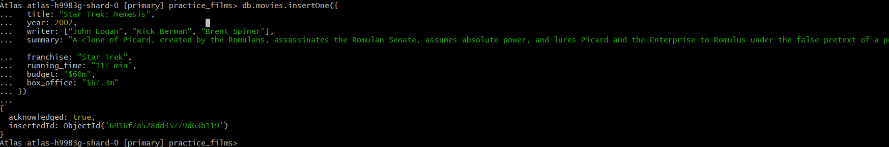


# Step 4: CRUD - Create

## 4.1 Inserting Data

- Add the supplied sample data into the movies collection using a **SINGLE** MongoDB Shell COMMAND in the order provided.

Query Solution:

```js
db.movies.insertMany([
  {
    title: "Avatar",
    writers: ["James Cameron"],
    yearReleased: 2009,
    runningTime: "162 minutes",
    budget: "$237 million"
  },
  {
    title: "Fictionally Fake Film"
  },
  {
    title: "Little Shop of Horrors",
    writers: ["Howard Ashman", "Charles B. Griffith"],
    yearReleased: 1986,
    boxOffice: "$54 million"
  },
  {
    title: "You Cannae be Serious About a Fictional Film"
  }
]);

```


## 4.2 Inserting Data

Download the `movie_data.tsv` (Tab separated) or `movie_data.csv` (Comma separated) file from blackboard.

Using the `mongoimport` CLI command, import the data from one of the files to your collection.

What was the complete command you used to perform the import of the provided sample data?

Query Solution:

```js
	mongoimport --db saas_bed_portfolio_2025s2 --collection movies --type csv --file movie_data.csv --headerline

```

## 4.3 Inserting Data

Add the provided additional sample data into the movies collection in the order provided.

> You do not have to add any details to the answers.md for this question.


# Step 5: CRUD - Retrieve Queries

## 5.1 Retrieve all documents

- Get all documents from the movies collection.

Query Solution:

```js
db.movies.find().pretty()
```

Screen Shot:

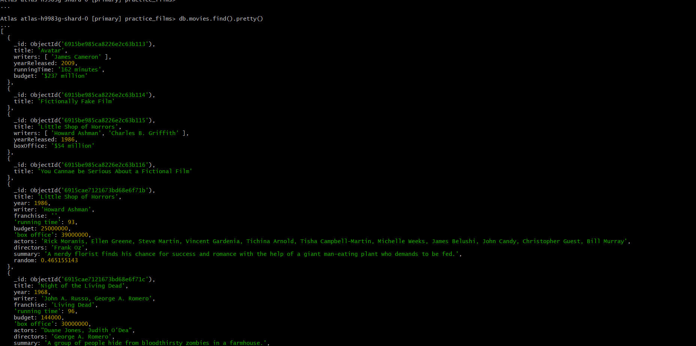

```
	
## 5.2 Retrieve all films written by…

- Get all documents with `writer` set to "`Quentin Tarantino`"

Query Solution:

```js
	db.movies.find({ writers: "Quentin Tarantino" }).pretty()

```

Screen Shot:

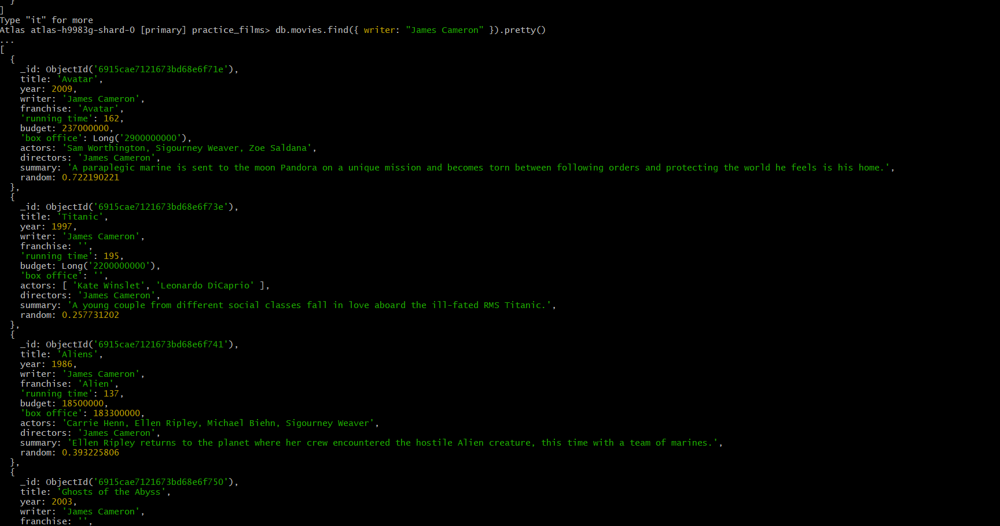

## 5.3 Retrieve films with actor(s)…

- Get all documents where `actors` include "`Brad Pitt`"

Query Solution:

```js
	db.movies.find({ actors: "Brad Pitt" }).pretty()
```

Screen Shot:

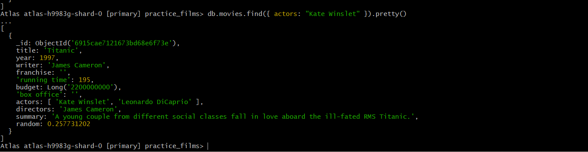

## 5.4 Retrieve films from a franchise…

- Get all documents with `franchise` set to "`The Hobbit`"

Query Solution:

```js
	db.movies.find({ franchise: "The Hobbit" }).pretty()
```

Screen Shot:

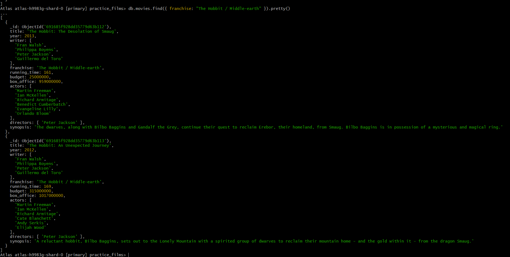

## 5.5 Retrieve films before/after…

- Get all movies released before `1970` or after `2020`

Query Solution:

```js
	db.movies.find({ $or: [ { yearReleased: { $lt: 1970 } }, { yearReleased: { $gt: 2020 } } ] }).pretty()

```
	
Screen Shot:

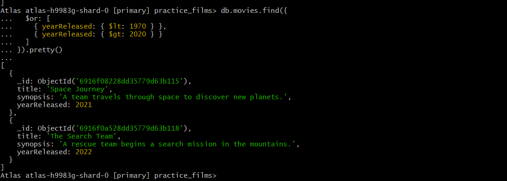

## 5.6 Retrieve films longer than…

- Get all movies with a running time of over `120` minutes

Query Solution:

```js
	db.movies.find({ runningTime: { $gt: 120 } }).pretty()
```

Screen Shot:

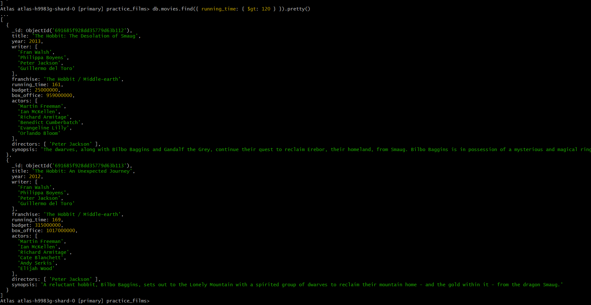

# Step 6: CRUD - Updates

## 6.1 Update document with a synopsis

- Using one or more queries, add the provided synopses to the indicated movies.

```js
	db.movies.updateOne({ title: "The Hobbit: The Desolation of Smaug" }, { $set: { synopsis: "The dwarves, along with Bilbo Baggins and Gandalf the Grey, continue their quest to reclaim Erebor, their homeland, from Smaug. Bilbo Baggins is in possession of a mysterious and magical ring." } });

db.movies.updateOne({ title: "The Hobbit: An Unexpected Journey" }, { $set: { synopsis: "A reluctant hobbit, Bilbo Baggins, sets out to the Lonely Mountain with a spirited group of dwarves to reclaim their mountain home - and the gold within it - from the dragon Smaug." } });

db.movies.find({ title: /Hobbit/ }, { title: 1, synopsis: 1 }).pretty()

```
	
## 6.2 Update document with an actor

- Add the provided actors to the required films using one or more queries in the order provided...

Query Solution:

```js
	// Add Samuel L. Jackson to Pulp Fiction
	db.movies.updateOne(
	  { title: "Pulp Fiction" },
	  { $addToSet: { actors: "Samuel L. Jackson" } }
	)

	// Add multiple actors to Star Trek VI
	db.movies.updateOne(
	  { title: "Star Trek VI: The Undiscovered Country" },
	  { $addToSet: { 
		  actors: { 
			$each: [
			  "William Shatner", "Leonard Nimoy", "DeForest Kelley", 
			  "James Doohan", "Christopher Plummer", "Walter Koenig", 
			  "Nichelle Nichols", "George Takei", "Kim Cattrall", "David Warner"
			] 
		  } 
		} 
	  }
	)

	// Add actors for Star Trek: Nemesis
	db.movies.updateOne(
	  { title: "Star Trek: Nemesis" },
	  { $addToSet: { actors: { $each: ["Patrick Stewart", "Jonathan Frakes", "Brent Spiner", "LeVar Burton", "Michael Dorn", "Gates McFadden", "Marina Sirtis"] } } }
	)

	// Verification query
	db.movies.find({ title: /Pulp Fiction|Star Trek/ }, { title: 1, actors: 1 }).pretty()

```

Screen Shot:

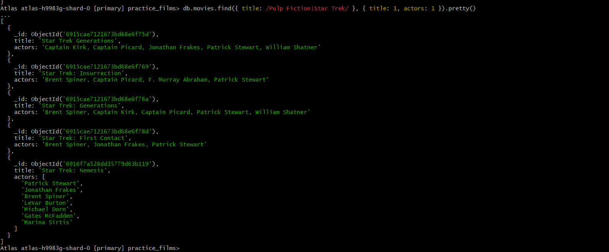


# Step 7: CRUD – Searches

Performing searches on collections.

## 7.1 Searching for titles with …

- Find all movies with the `title` starting with "`L`".

Query Solution:

```js
db.movies.find({ title: /^L/ }, { title: 1 }).pretty()
```

Screen Shot:

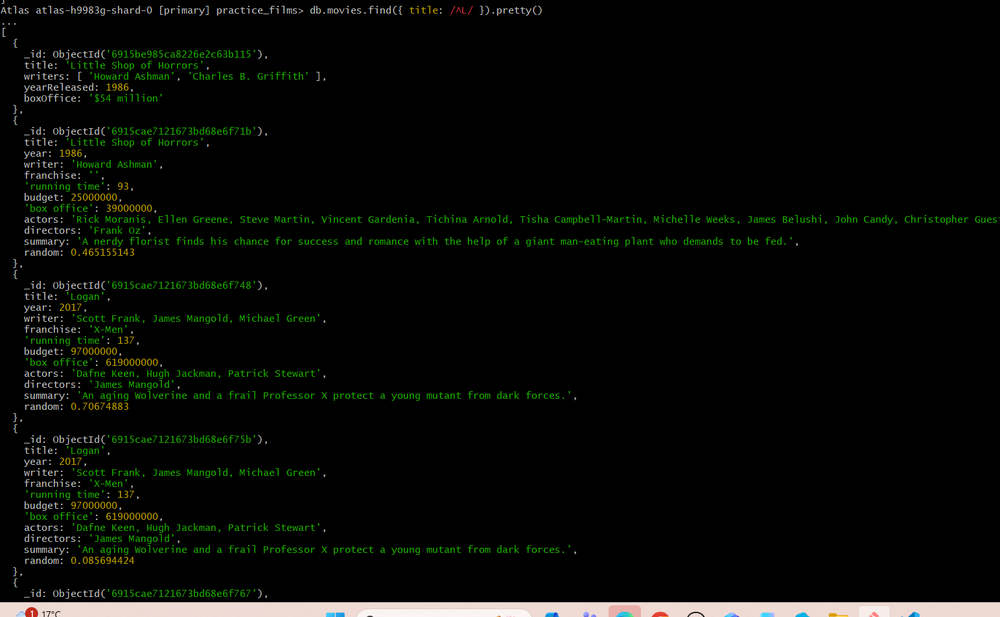

## 7.2 Searching for synopses with …

- Find all movies that have a `synopsis` that contains the word "`space`"

Query Solution:

```js
	db.movies.find({ synopsis: /space/i }, { title: 1, synopsis: 1 }).pretty()

```

Screen Shot:

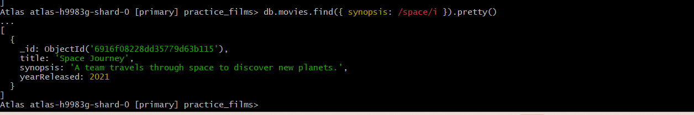

## 7.3 Searching for synopses with… and not …

- Find all movies that have a `synopsis` that contains the word "`Bilbo`" and not the word "`Gandalf`"

Query Solution:

```js
	db.movies.find({ synopsis: /Bilbo/i, synopsis: { $not: /Gandalf/i } }, { title: 1, synopsis: 1 }).pretty()

```

Screen Shot:

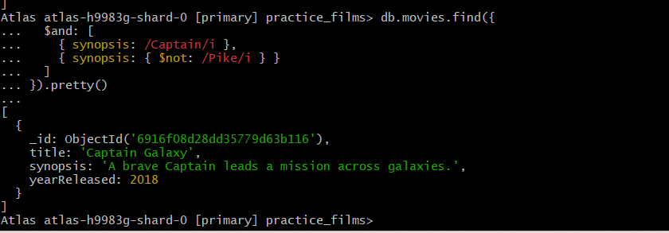

## 7.4 Searching for synopses with … or …

- Find all movies that have a `synopsis` that contains the word "`Klingon`" or "`Romulan`"

Query Solution:

```js
	db.movies.find({ $or: [{ synopsis: /Klingon/i }, { synopsis: /Romulan/i }] }, { title: 1, synopsis: 1 }).pretty()

```

Screen Shot:

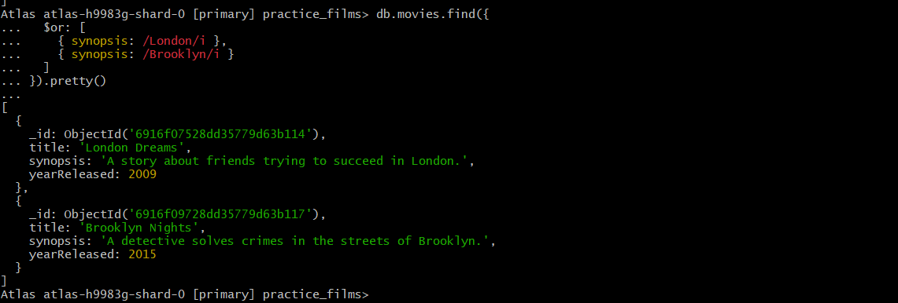

## 7.5 Searching for synopses with … and …

- Find all movies that have a synopsis that contains the words "`gold`" and "`dragon`"

Query Solution:

```js
db.movies.find({ synopsis: /gold/i, synopsis: /dragon/i }, { title: 1, synopsis: 1 }).pretty()

```

Screen Shot:

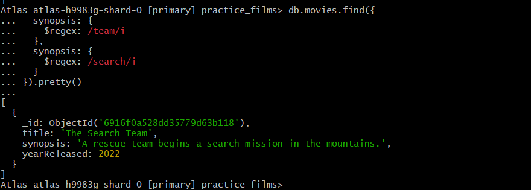


# Step 8: CRUD - Deletions

This step requires you to remove movies from the collection.

## 8.1 Removing a movie using its title…

- Delete the movie "`Pee Wee Herman's Big Adventure`"

Query Solution:

```js
	db.movies.deleteOne({ title: "Pee Wee Herman's Big Adventure" });

```

Screen Shot:

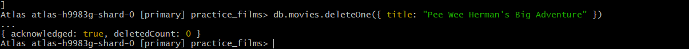

## 8.2 Remove a movie by ID…

Delete the movie “`Yet Another Fake Film Name`” by:

- Writing a query to discover the movie ID
- Then using the found ID to remove the movie

Query Solution:

```js
	const doc = db.movies.findOne({ title: "Yet Another Fake Film Name" });
db.movies.deleteOne({ _id: doc._id });

```

Screen Shot:

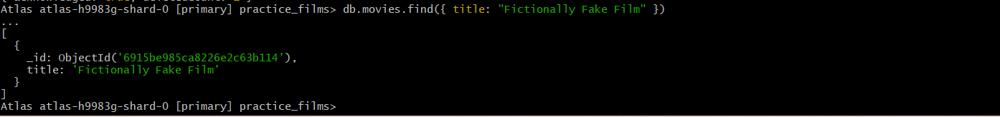

## 8.3 Removing multiple movies…

- Delete any movies with “`Fictional`” in their title

Query Solution:

```js
	db.movies.deleteMany({ title: /Fictional/ });

```

Screen Shot:

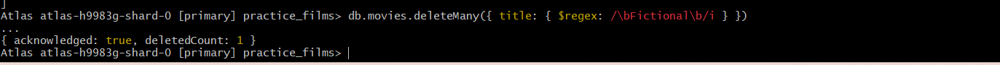


# Step 9: NoSQL Indexes

Using the movies collection, create the indexes to match the following conditions

## 9.1 Indexes for Sorting

- Create an index on the `title` field.

Query Solution:

```js
		db.collection_name.find();

```


- Create an index on the `year` and `title ` fields.

Query Solution:

```js
	db.movies.createIndex({ yearReleased: 1, title: 1 });
```

- Create an index on the `franchise`, `title`, `actors`, `year` fields.
- The index must be in the order year, title, actors then franchise.

Query Solution:

```js
	db.movies.createIndex({ yearReleased: 1, title: 1, actors: 1, franchise: 1 });

 ```
 Screen Shot:

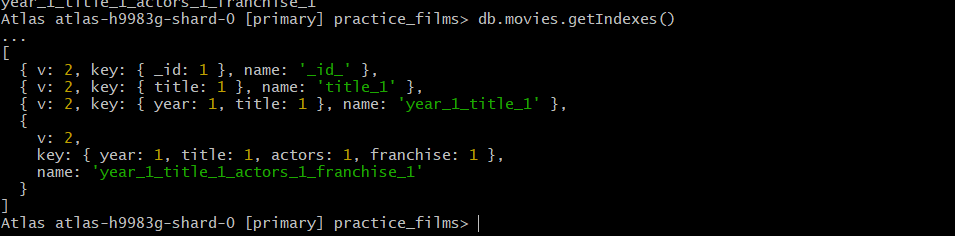


## 9.2 Indexes for Full Text Search

- Create a text index on the `title ` and `franchise` fields.

Query Solution:

```js
	db.movies.createIndex({ title: "text", franchise: "text" });

```


## 9.3 Verifying Execution Plans

- Check the execution plan for a query that finds the movies with a title containing “Star”. Check if the created index is being used.

Query Solution:

```js
db.movies.find({ $text: { $search: "Star" } }).explain("executionStats");

```

Screen Shot:

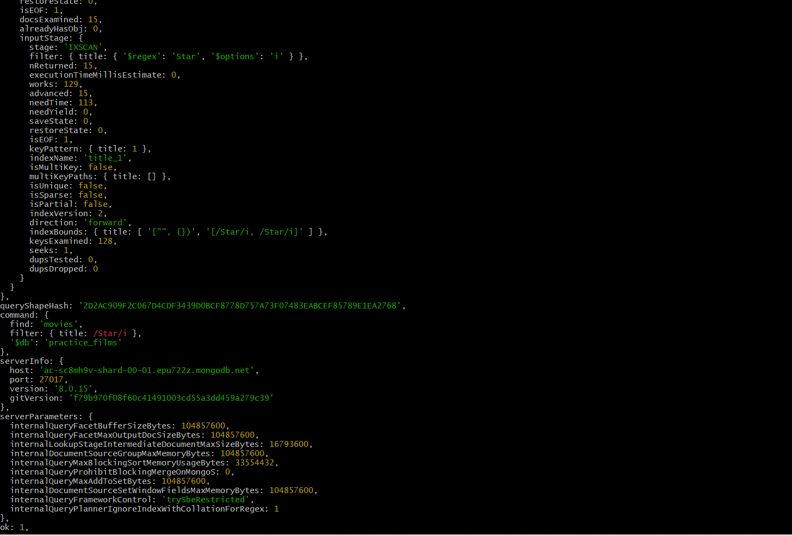


## 9.4 Differences in Indexes

- Briefly explain the differences between an index for sorting against an index for full text searches.

>Index for sorting arranges documents to allow fast ordered retrieval.
Text indexes enable fast searching of string content within fields, including partial matches and keyword searches.

 # Step 10: Aggregation

In this step you will be aggregating data within a collection.

## 10.1 Counting documents

- Write an aggregation query to count the number of `Star Wars` movies.


Query Solution:

```js
	db.movies.aggregate([
  { $match: { title: /Star Wars/i } },
  { $count: "starWarsCount" }
])
```

## 10.2 Mean box office takings…

- Write an aggregation query to calculate the average box office earnings.

Query Solution:

```js
db.movies.aggregate([
  {
    $group: {
      _id: null,
      avgBoxOffice: { $avg: "$boxOfficeNum" }
    }
  }
])

```

## 10.3 Profit earnings

- Write an aggregation query to calculate the profit (box office – budget) for the movies, showing just the movie title and the profit.

Query Solution:

```js
	db.movies.aggregate([
  {
    $project: {
      title: 1,
      profit: { $subtract: ["$boxOfficeNum", "$budgetNum"] }
    }
  }
])

```

Screen Shot:

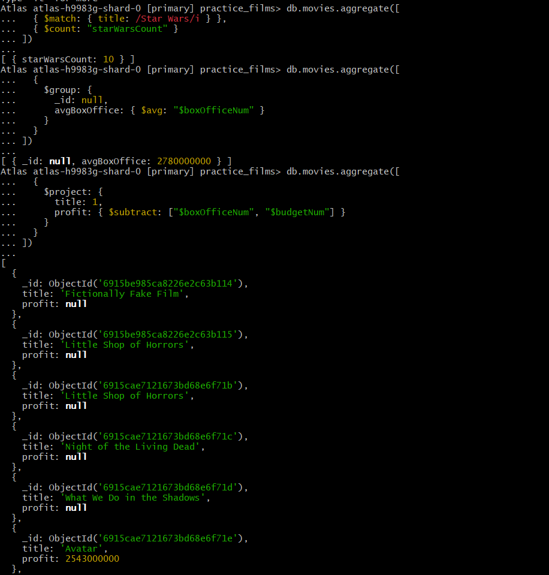

## 10.4 Grouping data

- Write the query to group movies by their franchise and count the number of movies in each franchise.

Query Solution:

```js
db.movies.aggregate([
  {
    $group: {
      _id: "$franchise",
      movieCount: { $sum: 1 }
    }
  },
  {
    $sort: { movieCount: -1 }
  }
])

```

# Step 11: Triggers

Using the movies collection, we are now going to create triggers to provide an audit trail for when data is added, updated or deleted.

## 11.1 Create trigger for inserted data

- Create a trigger that monitors the movies collection for new data being added. 

Query Solution:

```js
	exports = function(changeEvent) {
  const audit = context.services
    .get("mongodb-atlas")
    .db("practice_films")
    .collection("movie_audit");

  const fullDocument = changeEvent.fullDocument;

  return audit.insertOne({
    action: "INSERT",
    action_date: new Date(),
    original_data: fullDocument
  });
};


```

## 11.2 Testing the insert trigger works correctly

- Use the following data to check the trigger functions as expected:

Query Solution:

```js
	db.movies.insertOne({
  title: "Jeffrey",
  writer: "Paul Rudnick",
  yearReleased: 1995,
  actors: [
    "Sigourney Weaver",
    "Patrick Stewart",
    "Michael T. Weiss",
    "Steven Weber",
    "Bryan Batt"
  ],
  boxOffice: "$3.5 million",
  runningTime: "92 mins"
});

```

## 11.3 Create trigger for updated data

- Create a trigger that monitors the movies collection for new data being added. 

Query Solution:

```js
	exports = function(changeEvent) {
  const audit = context.services
    .get("mongodb-atlas")
    .db("practice_films")
    .collection("movie_audit");

  return audit.insertOne({
    action: "UPDATE",
    action_date: new Date(),
    original_data: changeEvent.fullDocumentBeforeChange,
    data: changeEvent.updateDescription.updatedFields
  });
};

```

Screen Shot:


## 11.4 Testing the update trigger works correctly

- Use the following data to verify that the trigger functions as expected. Make sure that these updates are completed in more than one query:

Query Solution:

```js

db.movies.updateOne(
  { _id: ObjectId("6915be985ca8226e2c63b114") },
  { $set: { writer: "Paul Rudnick" } }
);

```

## 11.5 Create trigger for deleted data

- Create a trigger that monitors the movies collection for new data being added. 

Query Solution:

```js
exports = function(changeEvent) {
  const audit = context.services
    .get("mongodb-atlas")
    .db("practice_films")
    .collection("movie_audit");
    .db("saas_bed_portfolio_2025s2")
    .collection("movie_audit_log");

  return audit.insertOne({
    action: "DELETE",
    action_date: new Date(),
    original_data: changeEvent.fullDocument
  });
};

```

## 11.6 Testing the delete trigger works correctly

- Use the following conditions to verify that the trigger functions as expected:

Query Solution:

```js

db.movies.insertOne({ title: "Dummy Movie", writer: "Test Writer", yearReleased: 2025 });


db.movies.deleteMany({ title: /Dummy/ });

```

## 11.7 Verify the log contains data…

- Write a query to show the data in the movie audit log.

Query Solution:

```js
	db.movie_audit.find().pretty()

```

Screen Shot:

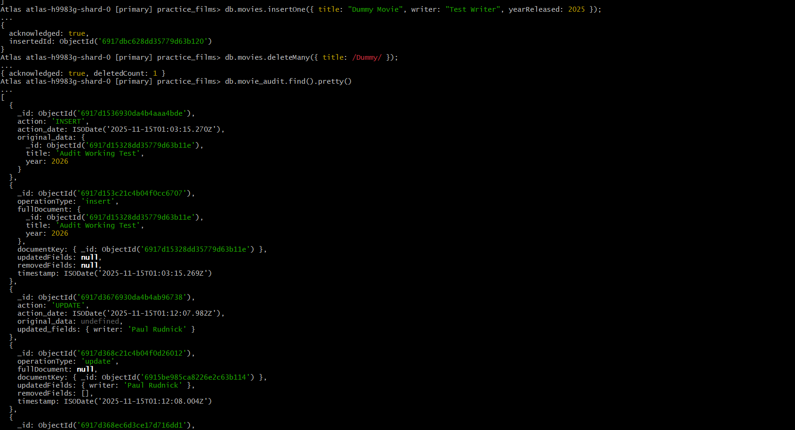


# Step 12: Submission

What is the URL for your GitHub (or equivalent) repository for this assessment?

```text
https://github.com/kdayal/kd-ict50220-saas-2-bed-nosql-2025-s2-
```

# END
